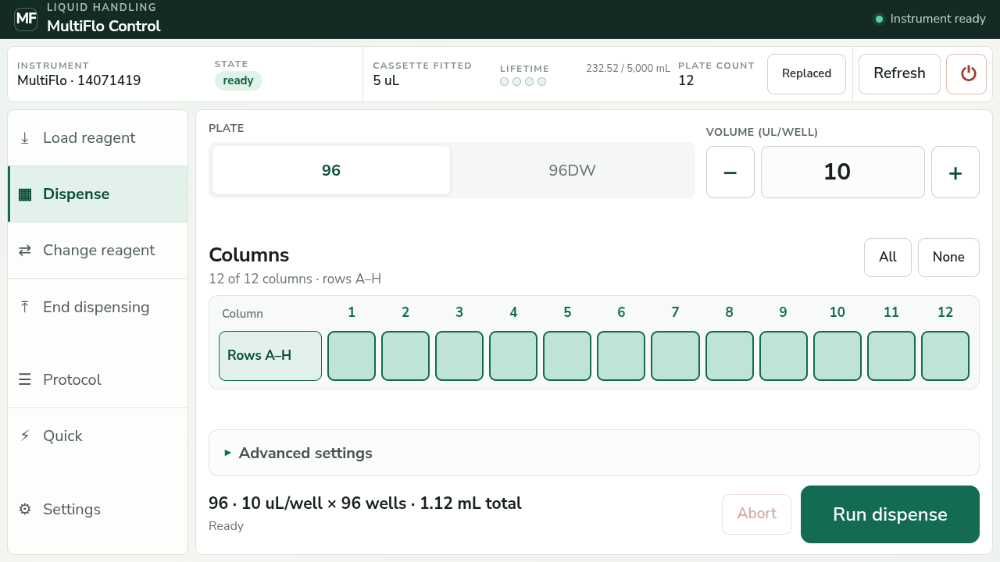
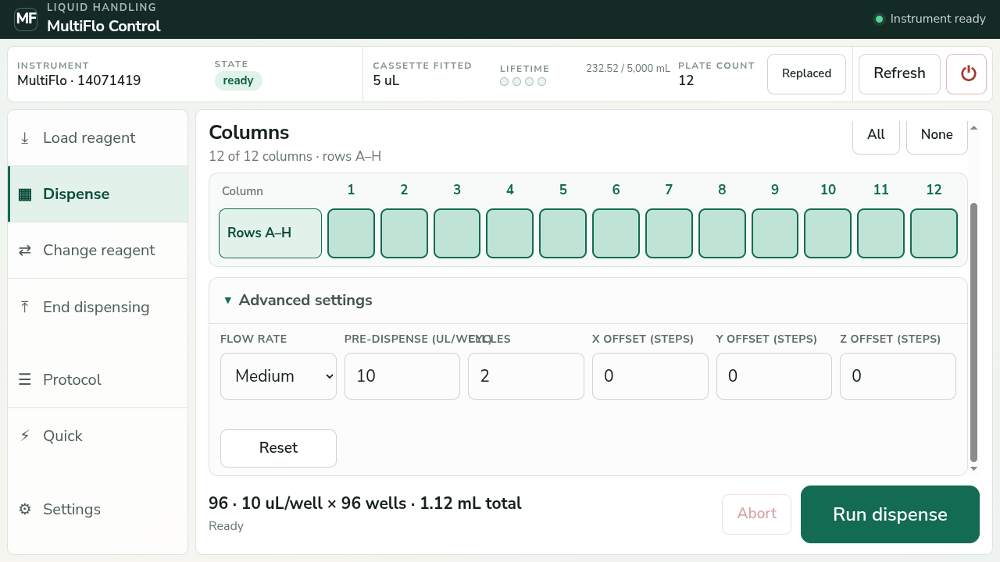
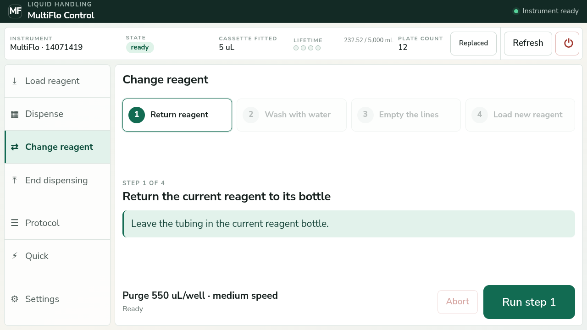
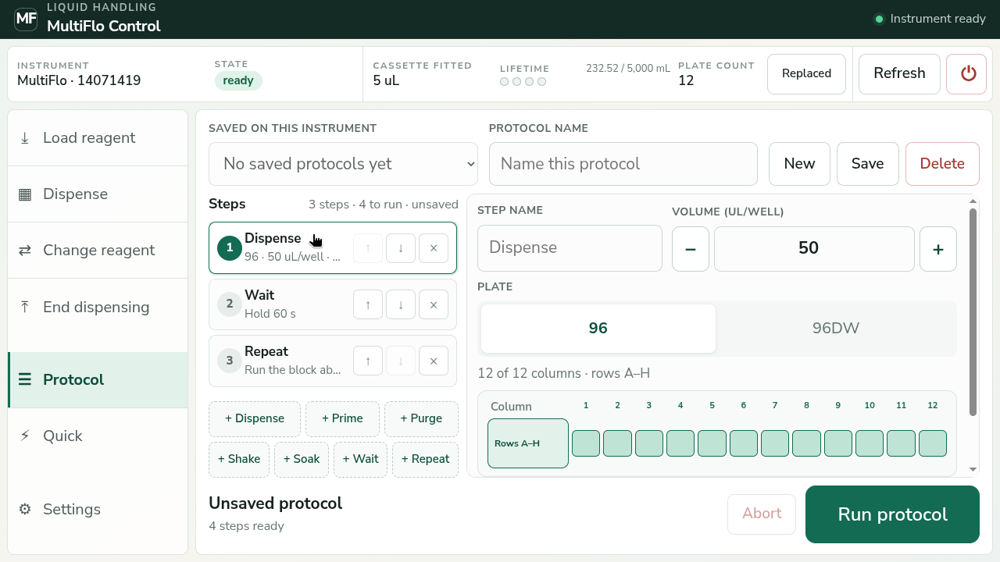
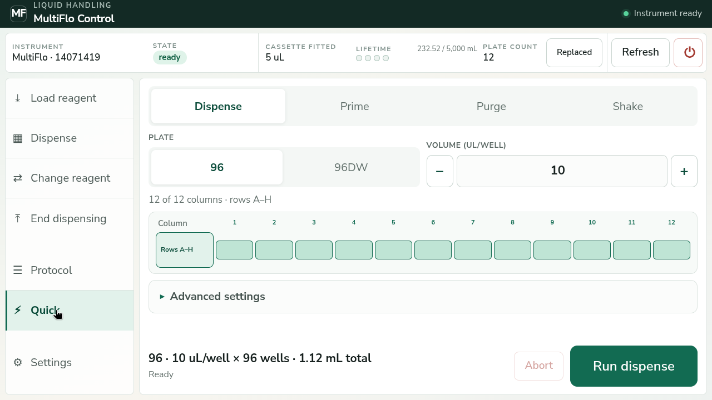
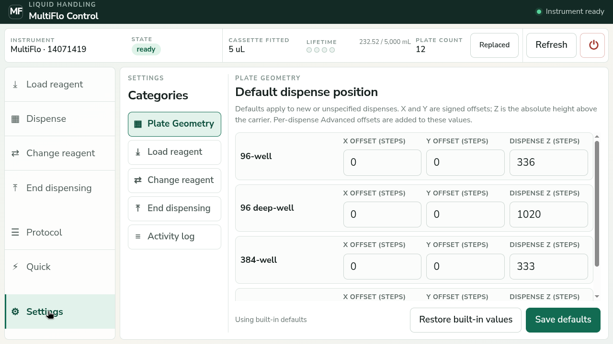

# MultiFlo touchscreen guide

Use this guide at the machine.

## Before any run

1. Power on the MultiFlo.
2. Power on the Raspberry Pi.
3. Wait for **Instrument ready**.
4. Check the instrument serial number.
5. Check the fitted cassette.
6. Check the tubing, liquid, waste, plate, pump cover, and carrier path.

**Run starts machine movement immediately.**

**Abort stops between steps. It is not an emergency stop.**

## Status bar

The top bar is shown on every screen.

- **Instrument**: machine name and serial number.
- **State**: must show **ready** before a run.
- **Cassette fitted**: cassette found by the machine.
- **Lifetime**: liquid used with this cassette.
- **Plate count**: completed dispense runs.
- **Replaced**: reset the cassette counters after fitting a new cassette.
- **Refresh**: read the machine state again.
- Power icon: shut down the Raspberry Pi. Use only when idle.

If **Reconcile** appears, first check that the machine is stationary. Check that no operation is running. Then press **Reconcile**.

## Normal work order

1. Use **Load reagent**.
2. Use **Dispense**.
3. Use **Change reagent** when needed.
4. Use **End dispensing** when finished.

## Dispense

1. Select the plate type.
2. Set **Volume (uL/well)**.
3. Select the columns.
4. For a 384-well plate, select the required row band.
5. Read the summary at the bottom.
6. Put the plate in place.
7. Press **Run dispense**.

Use **All** or **None** to change the full column map. Press one column to switch it on or off.

The bottom summary shows plate type, volume, well count, and total liquid.

### Enter a number

Press a number field to open the keypad.

1. Enter the value.
2. Check the allowed range.
3. Press **Set**.

An invalid value cannot be set. The `-` and `+` buttons change the value by one valid step.

### Advanced settings

Open **Advanced settings** only when the method requires it.

- **Flow rate**: low, medium, or high.
- **Pre-dispense**: liquid sent through the cassette before the plate.
- **Cycles**: number of pre-dispense cycles.
- **X/Y/Z offset**: temporary position changes for this dispense.
- **Reset**: return this panel to its normal values.

Do not change X, Y, or Z without a checked method.

## Guided reagent procedures

The same screen style is used for **Load reagent**, **Change reagent**, and **End dispensing**.

1. Read the active step.
2. Put the tubing where the instruction says.
3. Press the confirmation box when shown.
4. Check the action and volume at the bottom.
5. Press **Run step**.
6. Wait for completion. The next step then unlocks.

Do not move to the next step early.

### Load reagent

Use when the lines start in water.

1. Push out storage water.
2. Load reagent.

The lines finish full of reagent.

### Change reagent

1. Return the current reagent.
2. Wash with water.
3. Empty the lines.
4. Load the new reagent.

The lines finish full of the new reagent.

### End dispensing

1. Return the current reagent.
2. Wash with water.

The lines finish in water.

## Protocol

A protocol stores several steps.

1. Press **New**.
2. Enter a protocol name.
3. Add steps with the buttons below the step list.
4. Select each step and set its values.
5. Use the arrows to change the order. Use `x` to remove a step.
6. Press **Save**.
7. Review all steps.
8. Press **Run protocol**.

Available steps: Dispense, Prime, Purge, Shake, Soak, Wait, and Repeat.

- **Wait** pauses for a set time or for operator confirmation.
- **Repeat** repeats the block above it. The count is the total number of cycles.
- Plate-handling steps in one protocol must use one plate type.

To use an existing protocol, select it under **Saved on this instrument**. Review it before every run.

## Quick

Use **Quick** for one operation that does not need to be saved.

1. Select Dispense, Prime, Purge, or Shake.
2. Set the values.
3. Check the summary.
4. Prepare the machine.
5. Press **Run**.

Prime and purge volumes are shown in `uL/well`. The total is for all eight cassette channels.

## Settings

Use Settings only for checked machine defaults.

- **Plate Geometry**: default X, Y, and Z for each plate type.
- **Load reagent**: volume and speed for each load step.
- **Change reagent**: volume and speed for each change step.
- **End dispensing**: volume and speed for each end step.
- **Activity log**: recent dashboard messages.

**Save defaults** changes future runs. **Restore built-in values** loads the original values into the editor; save them to apply them.

## Stop or finish

- Press **Abort** to request a stop between steps.
- Wait until the machine reports **ready**.
- Do not shut down during a run or after an uncertain result.
- Use **End dispensing** before leaving the machine in water.
